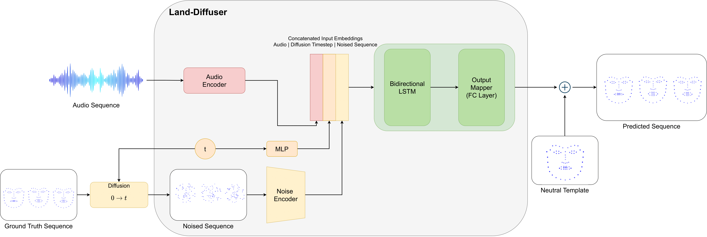

# Land-Diffuser
 <br/>
## Table of Contents  
- [About the Project](#1)  
  - [Built with](#2)
- [Dataset](#3)  
- [Usage](#4)
- [Inference](#5)
# About the Project <a name="1"/>
 <br/>
The Land-Diffuser is a novel application of the Denoising Diffusion Probabilistic Model (DDPM) in the realm of 3D Talking Head generation from raw audio inputs. This innovative approach leverages the power of DDPM to enhance the generation process. The model leverages a diffusion process, where a latent image is iteratively transformed by adding noise and subsequently denoised, leading to the generation of realistic samples.<br/>
The key idea is to learn a probabilistic model for the denoising process, allowing the model to capture complex dependencies in the data distribution. This is achieved by training the model on a dataset and optimizing its parameters to minimize the difference between the generated samples and the true data distribution. By utilizing raw audio inputs as a basis, the Land-Diffuser aims to create realistic and expressive 3D Talking Heads, opening avenues for more natural and immersive human-computer interactions. This integration of DDPM into the generation pipeline signifies a promising advancement in the synthesis of lifelike virtual characters driven by audio cues.
# Built with <a name="2"/>
To run the code, you need to install the following dependencies:

- Python 3.8
- PyTorch-GPU 1.13.0
- Trimesh 3.22.1
- Librosa 3.9.2
- Transformers 4.6.1 from Hugging Face
- MPI-IS for mesh rendering [link](https://github.com/MPI-IS/mesh)


# Dataset <a name="3"/>
For our experiments, we used the VOCAset dataset, which consists of 12 actors, evenly split between males and females. Each actor recorded 40 unique sentences, with duration ranging from 3 to 5 seconds. This dataset includes high-quality audio recordings and 3D facial reconstructions for every frame, captured at a frame rate of 60 frames per second. To facilitate our experiments, we divided the dataset into three separate subsets: one for training, one for validation, and one for testing. The training subset contained data from 8 actors, while the validation and test subsets each included data from 2 actors.     
# Usage <a name="4"/>
1. Clone the repository:
```sh
git clone https://github.com/LorenzoGianassi/Land-Diffuser.git
```
2. Download the vocaset dataset from [here](https://voca.is.tue.mpg.de/index.html) (Training Data, 8GB).
3. Put the downloaded file into the "Land_Diffuser/vocaset" and "S2D/vocaset" directories.
4. To train Land-Diffuser, preprocess the data by running "preprocess_voca_data.py" in the "Land_Diffuser/vocaset" directory. Then, run "train_lstm_ddpm.py".
5. To train S2D, preprocess the data by running "Data_processing.py" in the "S2D" directory. Then, run "train_S2D.py".

# Inference <a name="5"/>
1. Download the pretrained model from [here](https://drive.google.com/drive/folders/1h0l8cMUh_7GVedJykYH8zSEqNhj3BVeJ?usp=sharing) and place it in the  and "S2D/Results" directories.
2. Change paths in parser to follow folders used locally
3. Run the demo using "ddpm_demo.py" to generate a video.

# Authors
- **Lorenzo Gianassi**
# Acknowledgments
Master Thesis Project in cooperation with Professor [Stefano Berretti](https://www.unifi.it/p-doc2-2019-0-A-2b333d293228-1.html) and Phd student [Federico Nocentini](https://www.micc.unifi.it/people/federico-nocentini/#)  - Computer Engineering Master Degree @[University of Florence](https://www.unifi.it/changelang-eng.html)


